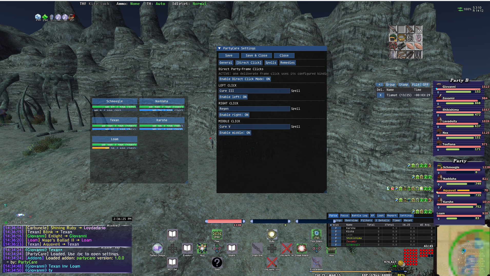

# PartyCare for Windower

> **By: Schmeee**



PartyCare for Windower is a compact transparent party and alliance grid for direct, player-initiated healing actions. It shares PartyCare’s configuration, HP/MP visual states, direct-click bindings, Alliance 2/3 support, and guardrails while using Windower-specific party, mouse, text, and command APIs.

## Install

Copy the `partycare` folder into `Windower4/addons/partycare`, then load it in game:

```text
//lua load partycare
```

Use either command below to show or hide the Windower settings summary:

```text
//partycare
//pc
```

## Grid and Alliance Members

PartyCare reads Windower’s `p0`–`p5`, `a10`–`a15`, and `a20`–`a25` party data keys into the same local, Alliance 2, and Alliance 3 model used by the Ashita release. Enable `show_alliance_2` or `show_alliance_3` in `settings.lua` to render those group sections when they contain active members.

Each direct click is tied to the member’s displayed slot. Local party requests use `<p0>`–`<p5>`; Alliance 2 uses `<a10>`–`<a15>` and Alliance 3 uses `<a20>`–`<a25>`.[1]

## Direct Clicks

Left, right, and middle releases can be configured in `settings.lua` through the `direct_click` table. A direct click produces at most one configured spell request for the card under the pointer. The manual dispatcher is controlled by:

```text
//pc dispatch on
//pc dispatch off
```

The `off` command is an immediate emergency disable. PartyCare contains no health-triggered casting, timers, queues, retries, hover casts, or background actions.

## Settings

The shared `settings.lua` file controls grid size, columns, MP display, transparency, Alliance 2/3 visibility, direct-click spell names, optional Refresh, and remedy priorities. This first Windower release uses a compact in-game settings summary and expects customization through the settings file; the Ashita build provides the full tabbed in-game editor.

## Remedy Scope

The Windower release keeps the shared configured remedy rules, but it does not infer remote party-member status effects from the basic Windower party snapshot. Remedy controls therefore remain unavailable until an explicit supported status-data provider is added. Direct healing, Refresh, HP/MP display, and Alliance 2/3 card targeting are available now.

## References

[1]: https://horizonffxi.wiki/Macro "HorizonXI Macro Target Placeholders"
